# SIMS - Klassendiagramm

Dieses Dokument enthält das Klassendiagramm für das SIMS (Service Incident Management System).

## Diagramm

```mermaid
classDiagram
    %% BackendApi Models
    class Incident {
        +string Id
        +string Summary
        +string Description
        +DateTime CreateDate
        +DateTime? ChangeDate
        +DateTime? ClosedDate
        +IncidentStatus? Status
        +IncidentType? IncidentType
        +IncidentSeverity? Severity
        +string? CustomerId
        +Guid UUId
        +List~IncidentComment~ Comments
    }
    
    class IncidentComment {
        +Guid CommentId
        +string IncidentId
        +Guid UserId
        +string? UserName
        +string? Comment
        +DateTime CreateDate
        +int CommentOrder
    }
    
    class Customer {
        +string? Id
        +string CompanyName
        +string Email
        +string? PhoneNumber
        +string? Address
        +string? City
        +string? State
        +string? ZipCode
        +string? Country
        +CustomerIsActive? Active
        +DateTime? CreateDate
        +DateTime? ChangeDate
        +Guid? UUId
    }
    
    %% sims-api Models
    class User {
        +int Uid
        +string Firstname
        +string Lastname
        +string Email
        +string PasswordHash
        +DateTime CreationDate
        +int RoleId
    }
    
    class Role {
        +int RoleId
        +string RoleName
        +string Description
    }
    
    class BlacklistedToken {
        +int Id
        +string Token
        +DateTime BlacklistedAt
    }
    
    %% Controllers
    class IncidentsController {
        -MsSqlDbContext _dbContext
        +GetAll() Task~ActionResult~
        +GetById(string) Task~ActionResult~
        +Create(Incident) Task~ActionResult~
        +Update(string, Incident) Task~ActionResult~
        +Delete(string) Task~ActionResult~
    }
    
    class CustomersController {
        -MsSqlDbContext _dbContext
        +GetAll() Task~ActionResult~
        +GetById(string) Task~ActionResult~
        +Create(Customer) Task~ActionResult~
        +Update(string, Customer) Task~ActionResult~
        +Delete(string) Task~ActionResult~
    }
    
    class AuthController {
        -UserDbContext _db
        -IConfiguration _config
        -IEventLogger _eventLogger
        +Login(LoginRequest) Task~IActionResult~
        +Logout() Task~IActionResult~
    }
    
    class UserController {
        -UserDbContext _db
        -IEventLogger _eventLogger
        +Create(CreateUserRequest) Task~IActionResult~
        +Modify(int, ModifyUserRequest) Task~IActionResult~
        +Delete(int) Task~IActionResult~
        +GetAll() Task~IActionResult~
        +GetCurrent() Task~IActionResult~
    }
    
    class RedisController {
        -RedisService _redisService
        +PostLog(LogEntry) Task~IActionResult~
        +GetLog(int) Task~IActionResult~
        +GetAllLogs() Task~IActionResult~
    }
    
    %% Services
    class GenerateIdService {
        <<static>>
        +IncidentId(MsSqlDbContext) string
        +CustomerId(MsSqlDbContext) string
    }
    
    class EventLogger {
        -IHttpClientFactory _httpClientFactory
        +LogEvent(string, string, int) Task
    }
    
    class IEventLogger {
        <<interface>>
        +LogEvent(string, string, int) Task
    }
    
    class RedisService {
        -IDatabase _db
        -IConnectionMultiplexer _connection
        +SaveLogAsync(LogEntry) Task~int~
        +GetLogAsync(int) Task~LogEntry~
        +GetAllLogsAsync() Task~List~LogEntry~~
        -GenerateNewLogIdAsync() Task~int~
    }
    
    class JwtTokenService {
        <<static>>
        +GenerateToken(User, IConfiguration) string
        +ValidateToken(string, IConfiguration) ClaimsPrincipal
    }
    
    class TokenBlacklistService {
        -UserDbContext _db
        +IsTokenBlacklisted(string) bool
        +BlacklistToken(string) Task
    }
    
    %% Database Contexts
    class MsSqlDbContext {
        +DbSet~Incident~ Incidents
        +DbSet~Customer~ Customers
        +DbSet~IncidentComment~ IncidentComments
    }
    
    class UserDbContext {
        +DbSet~User~ Users
        +DbSet~Role~ Roles
        +DbSet~BlacklistedToken~ BlacklistedTokens
    }
    
    class RedisConnection {
        +IConnectionMultiplexer Connection
        +GetConnection() IConnectionMultiplexer
    }
    
    %% Frontend Services
    class AuthApiHandler {
        -RestClient _client
        +LoginAsync(SignInModel) Task~AuthResponseUserLogon~
        +LogoutAsync(string) Task~bool~
    }
    
    class BackendApiHandler {
        -RestClient _client
        +GetIncidentsAsync() Task~List~Incident~~
        +GetIncidentAsync(string) Task~Incident~
        +CreateIncidentAsync(Incident) Task~Incident~
        +UpdateIncidentAsync(string, Incident) Task~Incident~
        +DeleteIncidentAsync(string) Task~bool~
    }
    
    class LogApiHandler {
        -RestClient _client
        +GetLogsAsync() Task~List~LogEntry~~
        +GetLogAsync(int) Task~LogEntry~
    }
    
    %% Relationships
    Incident "1" --> "*" IncidentComment : contains
    Customer "1" --> "*" Incident : has
    User "1" --> "1" Role : has
    User "*" --> "1" Role : belongs to
    BlacklistedToken ..> User : references
    
    IncidentsController --> MsSqlDbContext : uses
    IncidentsController --> Incident : manages
    CustomersController --> MsSqlDbContext : uses
    CustomersController --> Customer : manages
    IncidentsController --> GenerateIdService : uses
    
    AuthController --> UserDbContext : uses
    AuthController --> User : manages
    AuthController --> IEventLogger : uses
    UserController --> UserDbContext : uses
    UserController --> User : manages
    UserController --> IEventLogger : uses
    
    AuthController --> JwtTokenService : uses
    AuthController --> TokenBlacklistService : uses
    
    RedisController --> RedisService : uses
    RedisService --> RedisConnection : uses
    RedisService --> LogEntry : manages
    
    EventLogger ..|> IEventLogger : implements
    
    AuthApiHandler --> AuthController : calls
    BackendApiHandler --> IncidentsController : calls
    BackendApiHandler --> CustomersController : calls
    LogApiHandler --> RedisController : calls
```



## Legende

- **Models**: Datenmodelle (Incident, Customer, User, etc.)
- **Controllers**: API-Controller für HTTP-Endpunkte
- **Services**: Geschäftslogik und Hilfsservices
- **Database Contexts**: Entity Framework DbContext-Klassen
- **Frontend Services**: API-Handler im Blazor Frontend

## Diagramm in Bild konvertieren

Um das Diagramm in ein Bild (PNG, SVG, PDF) zu konvertieren, können Sie folgende Tools verwenden:

### Option 1: Mermaid Live Editor (Online)
1. Öffnen Sie https://mermaid.live/
2. Kopieren Sie den Inhalt aus `ClassDiagram.mmd`
3. Exportieren Sie als PNG oder SVG

### Option 2: Mermaid CLI (Command Line)
```bash
# Installation
npm install -g @mermaid-js/mermaid-cli

# Konvertierung zu PNG
mmdc -i Flipcharts/ClassDiagram.mmd -o Flipcharts/ClassDiagram.png

# Konvertierung zu SVG
mmdc -i Flipcharts/ClassDiagram.mmd -o Flipcharts/ClassDiagram.svg

# Konvertierung zu PDF
mmdc -i Flipcharts/ClassDiagram.mmd -o Flipcharts/ClassDiagram.pdf
```

### Option 3: VS Code Extension
1. Installieren Sie die "Markdown Preview Mermaid Support" Extension
2. Öffnen Sie `ClassDiagram.md`
3. Rechtsklick auf das Diagramm → "Export Diagram"

### Option 4: GitHub
- Das Diagramm wird automatisch gerendert, wenn Sie `ClassDiagram.md` auf GitHub hochladen
- Sie können dann einen Screenshot machen

## Dateien

- `ClassDiagram.mmd` - Reine Mermaid-Datei (für Tools)
- `ClassDiagram.md` - Markdown-Datei mit Diagramm (für GitHub/Viewer)

